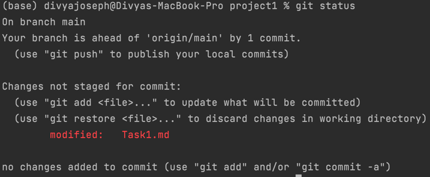
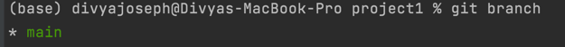
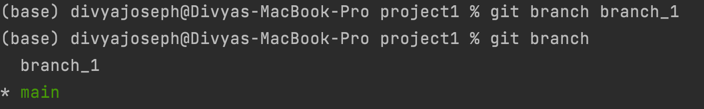
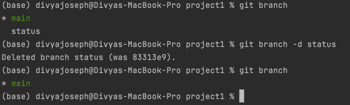
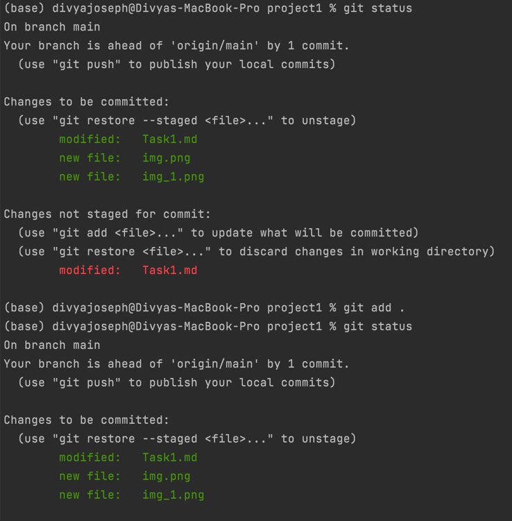
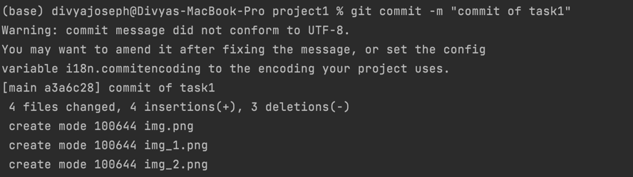
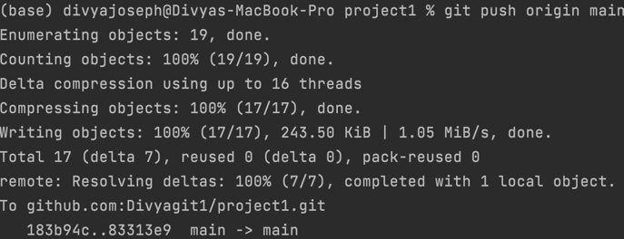
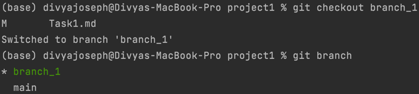
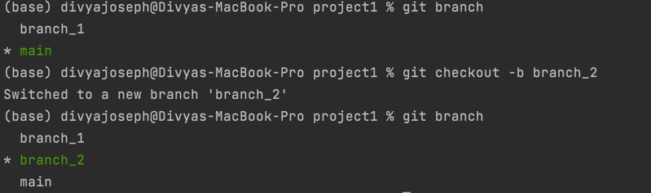

# Task 1:
## Demonstrate minimum 15 basic Git command with explanation and screenshot

1. git status : It displays the current status of the repository, to show which files are staged, unstaged, and untracked. It is advised to use before and after staging and committing.     
2. git branch : To show the current branch. Branches are actually the pointers to the commits.    
3. git branch <branch_name> : To create a now branch in the local repository.    
4. git branch -d <branch_name> : delete a branch from the local repository.    
5. git add : It stages all the changes in the working directory for the next commit.    
6. git commit : It captures a snapshot of the project's currently staged changes.   
7. git push : The git push command is used to upload local repository content to a remote repository.   
8. git checkout : The git checkout command lets you navigate between the branches created by git branch. The git checkout command may occasionally be confused with git clone. The difference between the two commands is that clone works to fetch code from a remote repository, alternatively checkout works to switch between versions of code already on the local system.   
9. git checkout -b ＜new-branch＞ : The git checkout command accepts a -b argument which will create the new branch and immediately switch to it.    
10. 