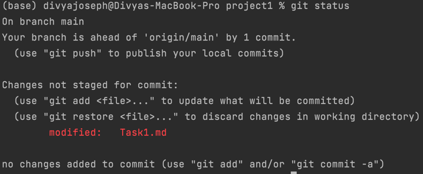
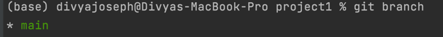
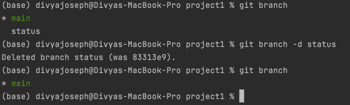
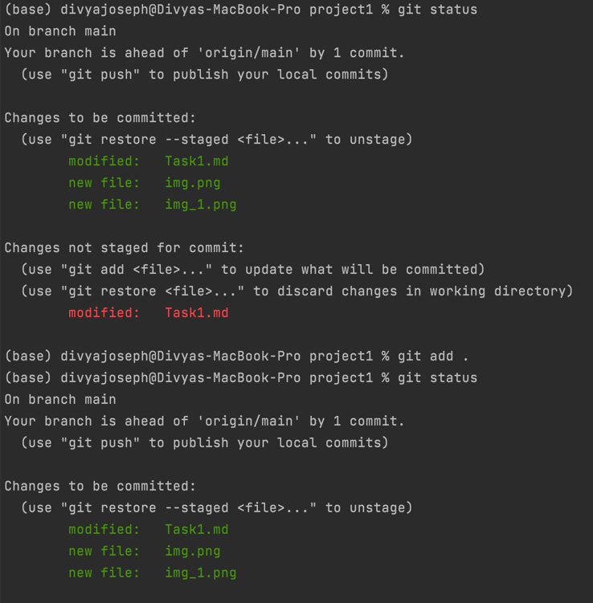
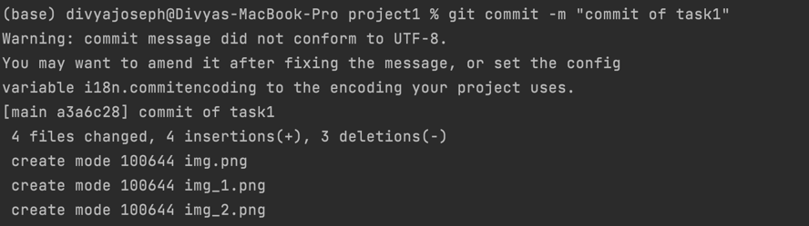
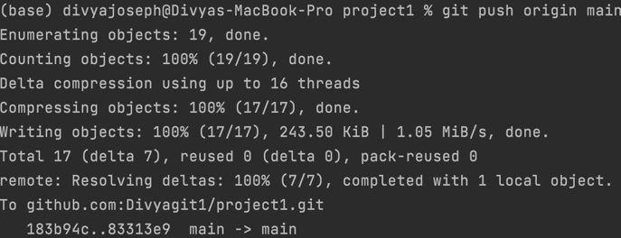

# Task 1:
## Demonstrate minimum 15 basic Git command with explanation and screenshot

1. git status : It displays the current status of the repository, to show which files are staged, unstaged, and untracked. It is advised to use before and after staging and committing.     
2. git branch : To show the current branch. Branches are actually the pointers to the commits.    
3. git branch -d <branch_name> : delete a branch from the local repository.    
4. git add : It stages all the changes in the working directory for the next commit.    
5. git commit : It captures a snapshot of the project's currently staged changes.   
6. git push : The git push command is used to upload local repository content to a remote repository.   